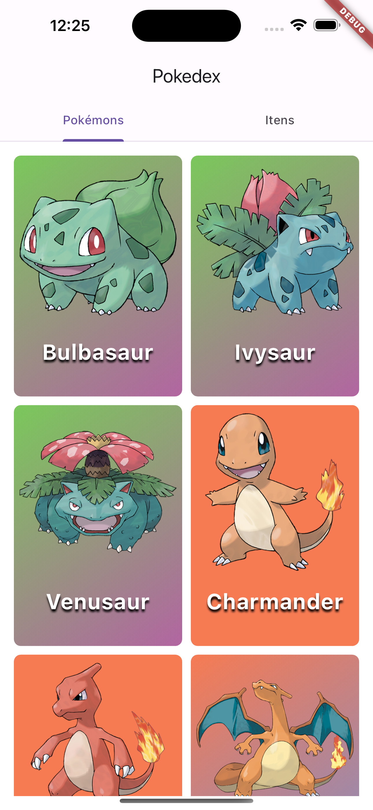
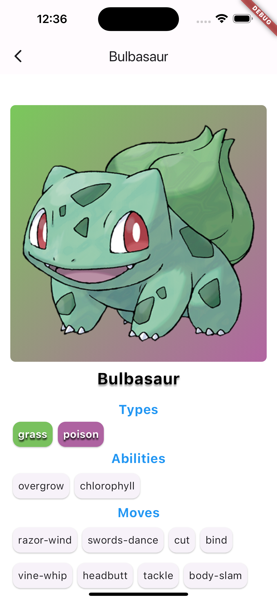
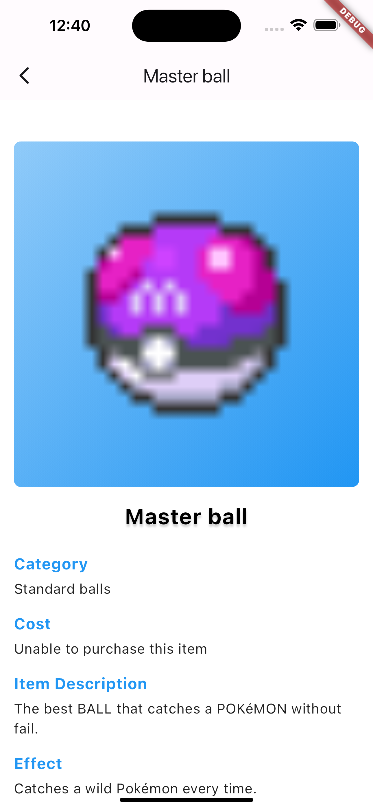

# Aplicativo Pokedex

O aplicativo Pokedex é uma ferramenta desenvolvida para os fãs de Pokémon que desejam explorar e aprender mais sobre os Pokémon e itens do universo Pokémon. Este aplicativo está bem simples, mas nele os usuários podem descobrir informações detalhadas sobre os Pokémon, incluindo suas habilidades, movimentos, tipos e estatísticas. Além disso, eles podem explorar os diferentes itens disponíveis no mundo Pokémon, incluindo poções, pokebolas e muito mais.

## Recursos Principais

- **Lista de Pokémon:** Os usuários podem navegar por uma extensa lista de Pokémon, pesquisar por nome ou tipo e visualizar detalhes sobre cada Pokémon, incluindo imagem, habilidades, movimentos e estatísticas.

- **Detalhes do Pokémon:** Os usuários podem visualizar detalhes específicos de cada Pokémon, como sua categoria, custo, efeitos e texto de sabor.

- **Lista de Itens:** Os usuários podem explorar uma variedade de itens disponíveis no mundo Pokémon, pesquisar por nome ou categoria e visualizar detalhes sobre cada item.

- **Detalhes do Item:** Os usuários podem ver detalhes específicos de cada item, incluindo sua categoria, custo, efeitos e texto de sabor.

## Tecnologias Utilizadas

- **Flutter:** O aplicativo foi desenvolvido utilizando o framework Flutter, que permite a criação de aplicativos multiplataforma com uma única base de código.

- **Dart:** A linguagem de programação Dart foi usada para escrever o código-fonte do aplicativo.

- **PokeApi:** API Restful de pokémon, documentação: https://pokeapi.co/

- **MobX:** Biblioteca de gerenciamento de estado para aplicativos, ele segue o padrão de gerenciamento de estado reativo, onde os dados são armazenados em observáveis e as alterações nesses dados são propagadas automaticamente apenas nas partes relevantes da interface.

- **Dio:** Biblioteca para fazer requisições HTTP de forma simples e eficiente.

## Capturas de Tela

